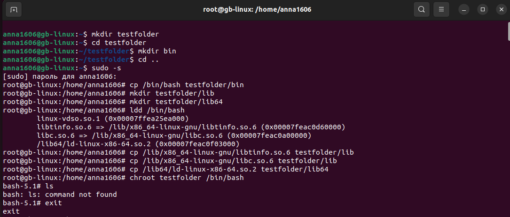
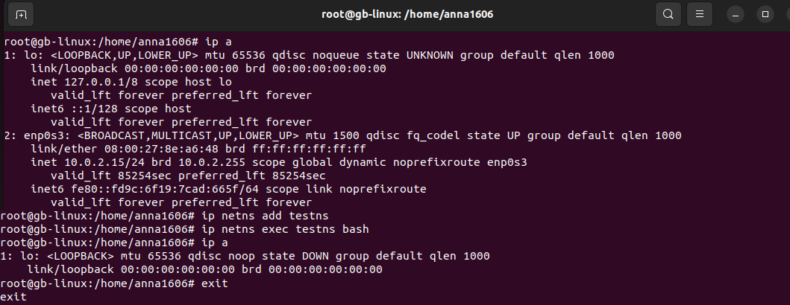
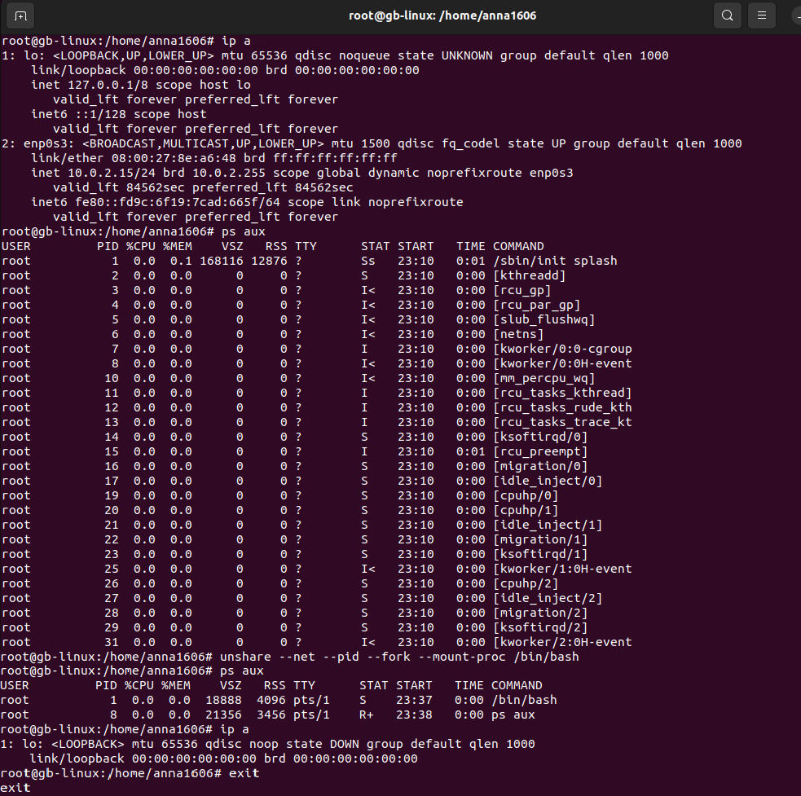

# Урок 1. Механизмы пространства имен

## Задание: необходимо продемонстрировать изоляцию одного и того же приложения (как решено на семинаре - командного интерпретатора) в различных пространствах имен.

### 1. Вызов chroot

1) Создаём папку `testfolder` в своем пользовательском каталоге.
```sh 
    mkdir testfolder
```
2) Переключаем управление командами на суперпользователя (root).
``` sh
    sudo -s
```
3) Копируем исполняемый файл командного интерпретатора `/bin/bash` в папку `testfolder/bin`.
``` sh
    cp /bin/bash testfolder/bin 
```
4) Создаем внутри папки `testfolder` подпапки `lib` и `lib64`.
``` sh
    mkdir testfolder/lib
    mkdir testfolder/lib64
```
5) Чтобы выяснить какие бибилиотеки требуются для работы оболочки bash, используем следующую команду: 
``` sh
    ldd /bin/bash
```
6) Копируем необходимые библиотеки из папки командного интерпретатора.
``` sh
    cp /lib/x86_64-linux-gnu/libtinfo.so.6 testfolder/lib
    cp /lib/x86_64-linux-gnu/libc.so.6 testfolder/lib
    cp /lib64/ld-linux-x86-64.so.2 testfolder/lib64/
```
7) Изменяем корневую папку и создаем изолированную файловую систему.
``` sh
    chroot testfolder /bin/bash
``` 
8) Пробуем выполнить внутри новой файловой системы простейшую команду `ls` и убеждаемся, что это невозможно, т.к. для обеспечения работоспособности этой файловой системы нужно скопировать множество соответствующих исполняемых файлов. 
9) Выходим из изолированного файлового пространства командой 
``` sh
exit
```



### 2. Вызов ip netns

1) Чтобы посмотреть доступные интерфейсы сетевого пространства, используем команду
``` sh
    ip a
```

2) Создаём изолированное сетевое пространство под называем `testns`.
``` sh
    ip netns add testns
```
3) Запускаем в нём `bash` 
``` sh
    ip netns exec testns bash
```
4) Проверяем доступные интерфейсы, повторяя команду `ip a`, и видим только один интерфейс.  
5) Выходим из сетевой изоляции командой
```sh
    exit
```


### 3. Вызов unshare 

1) Чтобы посмотреть доступные интерфейсы до создания изолированного сетевого пространства, используем команду
``` sh
    ip a
```

2) Чтобы увидеть процессы до режима изоляции, используем команду
``` sh
    ps aux
```
3) Чтобы попасть в изолированный контейнер, используем команду
``` sh
    unshare --net --pid --fork --mount-proc /bin/bash`
```
    где:  
    `--net` — ограничевает сетевое пространство имен  
    `--pid` — изолирует дерево процессов  
    `--fork` — изолирует память  
    `--mount-proc` — разграничивает процессы   

4) Повторяем ввод команд `ip a` и `ps aux`, чтобы увидеть набор данных внутри контейнера, в котором ещё ничего не настроено и не запущено.  
5) Выходим из контейнера командой 
``` sh
    exit
```

