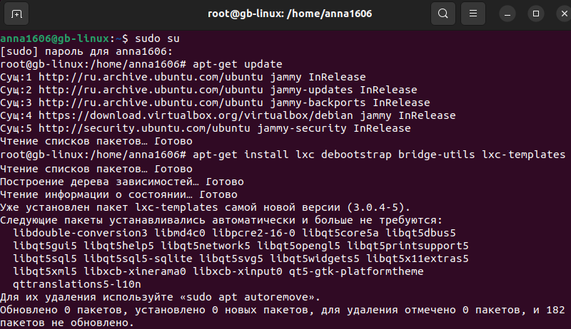
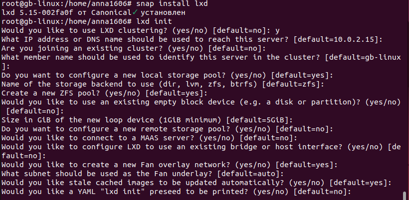
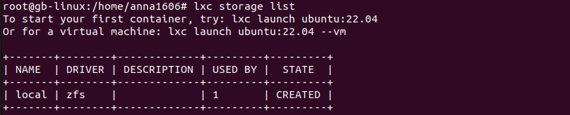
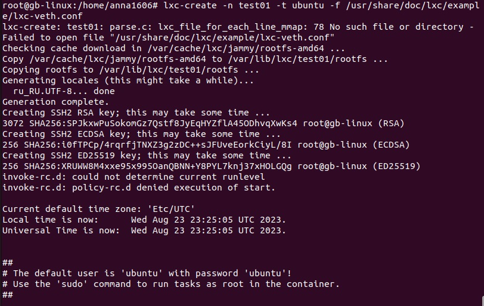
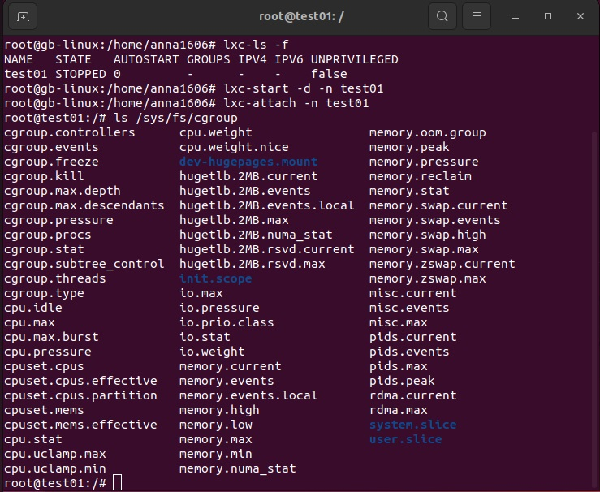
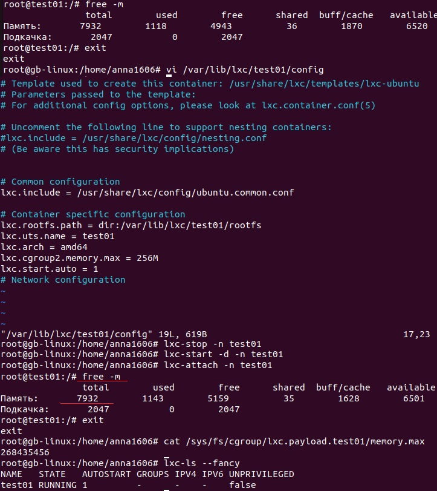

# Урок 2. Механизмы контрольных групп

##  1. Запустить контейнер с ubuntu, используя механизм `LXC`
### Установка и настройка `LXC`

* Переключаем управление командами на суперпользователя (root):
``` sh
    sudo su
```
* Обновляем информацию о подключенных репозиториях:
``` sh
    apt-get update
```
* Устанавливаем необходимые пакеты и шаблон образа ОС, которая будет внутри контейнера:
``` sh
    apt-get install lxc debootstrap bridge-utils lxc-templates
```
* Устанавливаем инструмент LXD Installer для установки и настройки LXD на сервере (`LXD` - виртуализация операционных систем):
``` sh
    apt-get install lxd-installer
```
    !!! на некоторых версиях ubuntu без команды
    snap install lxd 
    не работает


### Инициализация LXD

* Инициализация основных компонент `LXD` (настройка LXD):
``` sh
    lxd init
```

* Проверяем список доступных хранилищ в `LXD`:
``` sh
    lxc storage list
```




### Запуск контейнера из шаблона ubuntu
* Создаем контейнер из образа ubuntu (образ ОС):
``` sh
    lxc-create -n test01 -t ubuntu -f /usr/share/doc/lxc/example/lxc-veth.conf
```
* Проверяем, что контейнер создан:
``` sh
    lxc-ls -f
```
* Запускаем контейнер в режиме демона:
``` sh
    lxc-start -d -n test01
```
* Подключаемся к контейнеру:
``` sh
    lxc-attach -n test01
```



##  Ограничить контейнер 256 Мб ОЗУ и проверить, что ограничение работает. Настроить автозапуск контейнера

* Проверяем исходный размер ОЗУ до ограничения:
``` sh
    free -m
```
* Выходим из контейнера:
``` sh
    exit
```
* Открываем для редактирования файл с конфигурацией нашего контейнера:
``` sh
    vi /var/lib/lxc/test01/config
```
* Вносим команды внутри файла с конфигурацией для изменения объема ОЗУ и для возможности автозапуска контейнера:
``` sh
    lxc.cgroup2.memory.max = 256M
    lxc.start.auto = 1
```
* Перезапускаем контейнер:
``` sh
    lxc-stop -n test01
    lxc-start -d -n test01
    lxc-attach -n test01
```
* Пытаемся проверить размер ОЗУ после ограничения внутри контейнера командой `free -m` и видим, что она не работает (команда выводит информацию об общей доступной памяти, выделенной `ubuntu`). Для проверки ограничения памяти выходим из контейнера и используем команду:
``` sh
    cat /sys/fs/cgroup/lxc.payload.test01/memory.max
```
    Результат 268435456 байт = 256 Мегабайт

* Проверяем установку автозапуска контейнера командой:
``` sh
    lxc-ls --fancy
```
