# Урок 3. Введение в Docker

## Установка Docker
* Переключаем терминал в режим суперпользователя:
``` sh
    sudo su
```
* Обновляем список пакетов в системе:
``` sh
    apt update
```
* Обновляем имеющиеся в системе пакеты до последних версий:
``` sh
    apt upgrade
```
* Устанавливаем пакеты, которые позволят использовать репозиторий по HTTPS:
```sh
    apt install apt-transport-https ca-certificates curl software-properties-common
```
* Добавляем официальный GPG-ключ Docker:
```sh
    curl -fsSL https://download.docker.com/linux/ubuntu/gpg | gpg --dearmor -o /usr/share/keyrings/docker-archive-keyring.gpg
```
* Добавляем репозиторий Docker к списку источников пакетов:
```sh
    echo "deb [signed-by=/usr/share/keyrings/docker-archive-keyring.gpg] https://download.docker.com/linux/ubuntu $(lsb_release -cs) stable" | tee /etc/apt/sources.list.d/docker.list > /dev/null
```
* Обновляем список пакетов, чтобы включить информацию о пакетах Docker из добавленного репозитория:
```sh
    apt update
```
* Устанавливаем Docker:
```sh
    apt install docker-ce
```
* Добавляем своего пользователя в группу docker, чтобы избежать использования sudo для запуска Docker команд:
```sh
    usermod -aG docker $USER
```
* Применяем изменения в текущем сеансе (вместо команды можно перезагрузить систему):
```sh
    newgrp docker
```
* Проверяем работу Docker:
```sh
    docker --version
```
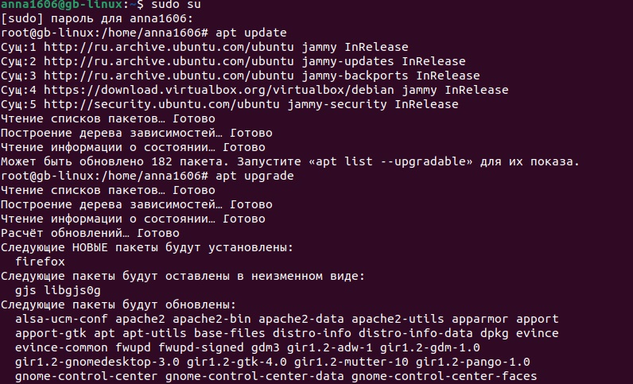
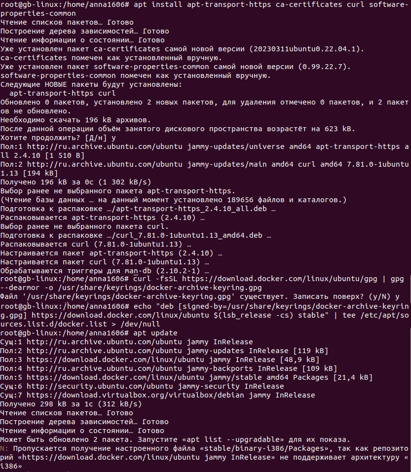
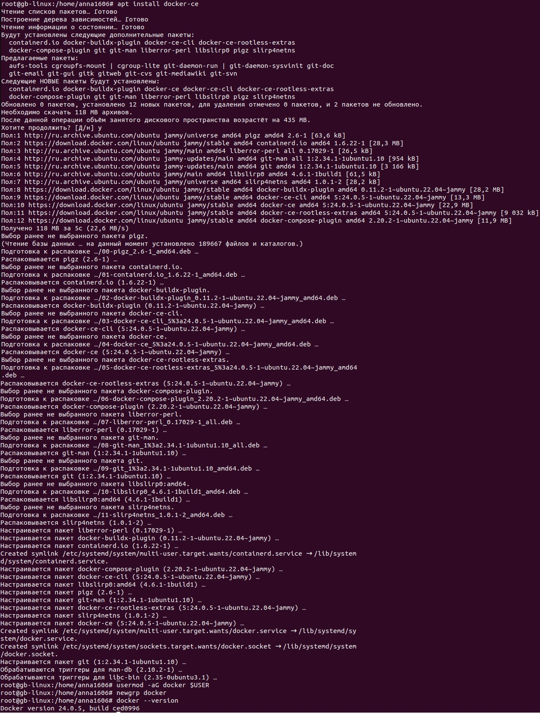

## Тест для проверки корректной работы Docker
Команды запустят контейнеры с различными рисунками животных с использованием образа `cowsay`. Вы можете заменить текст `Hello, Docker!` на любой другой текст, который вы хотите, чтобы животное `сказало`. Таким образом, вы сможете не только визуально проверить работу Docker, но и весело провести время!
```sh
    docker run docker/whalesay cowsay "Hello, Docker!"
    docker run docker/whalesay cowsay -f kitty "Hello, Anna!"
```
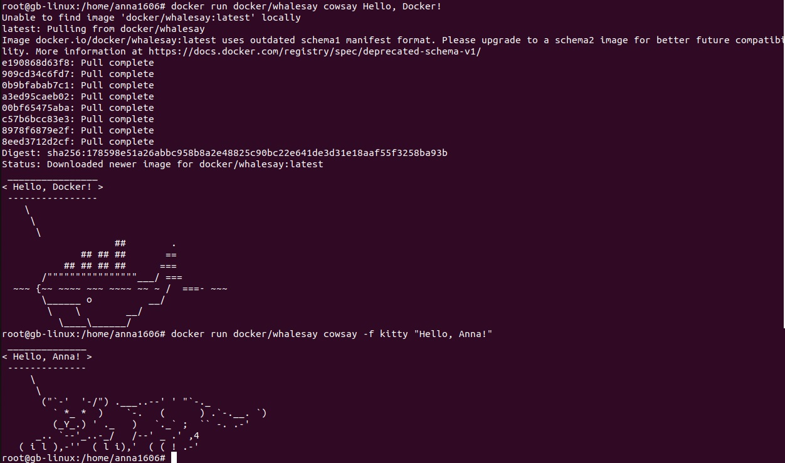

## Тестирование команд Docker
### Работа с образами

* Просмотр списка образов:
```sh
    docker images
```
* Загрузка образа с Docker Hub (example image Python):
```sh
    docker pull python
```
* Сборка образа из Dockerfile:
```sh
    docker build -t <название образа и путь до проекта>
```
* Удалить образ:
```sh
    docker rmi python
```
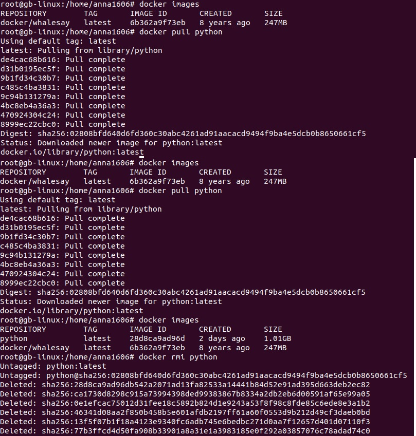

### Управление контейнерами

* Просмотр списка всех контейнеров (включая остановленные):
```sh
    docker ps -a
```
* Просмотр списка запущенных контейнеров:
```sh
    docker ps
```
* Удаление определенных контейнеров возможно с использованием двух вариантов информации: указанием `id` контейнера или его `имени`. Информацию об этом можно скопировать из списка всех контейнеров. Это будут первый и последний столбец вывода команды `docker ps -a`
```sh
    docker rm <container id>
    docker rm <container name>
```
* Чтобы удалить все контейнеры воспользуемся командой:
```sh
    docker rm $(docker ps -aq)
```
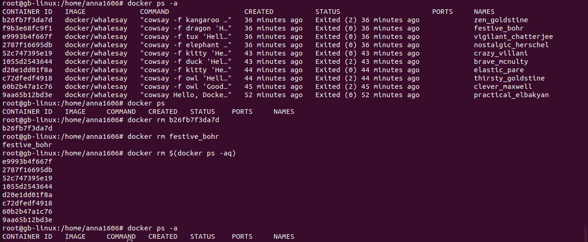

* Просмотр логов контейнера возможен при помощи команды:
```sh
    docker logs <container name>
```
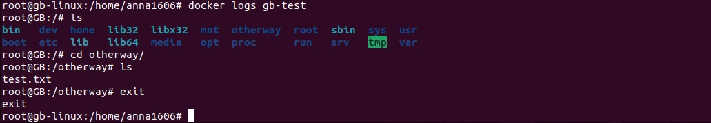

## Хранение данных в контейнерах Docker
* Запуск контейнера из образа Ubuntu и вход в него.

Если нет установленного образа убунты, то автоматически происходит скачивание последнего образа (или конкретной версии, если она указана).
Командой сразу присваиваем `hostname` и `container name`
```sh
    docker run -it -h GB --name gb-test ubuntu:22.10 bash
```
* Просмотр содержимого корневой директории:
```sh
    ls -l /
```
* Создание директории в корне:
```sh
    mkdir /example
```
* Создание текстового файла. Запись в него данных и их вывод без использования текстового редактора:
```sh
    touch /example/passwords.txt
    echo "123qwe" >> /example/passwords.txt
    cat /example/passwords.txt
```
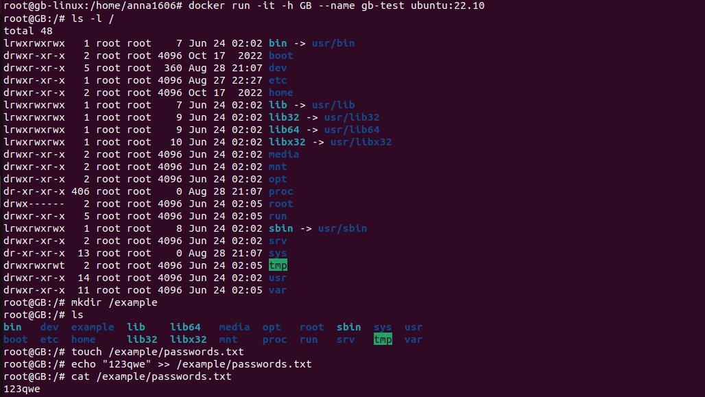

### Задача: Попробуем остановить контейнер и затем запустить его снова. Сохранятся ли наши данные?
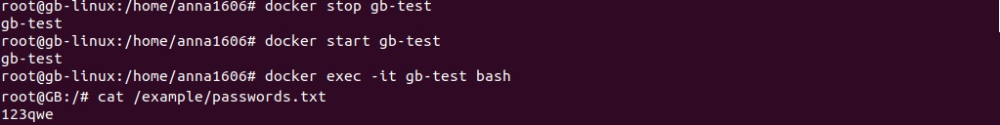
Наши данные сохранятся, так как мы не пересоздавали контейнер.

### Задача: Удалим контейнер и создадим его заново, используя те же команды. Сохранятся ли наши данные в этом случае?
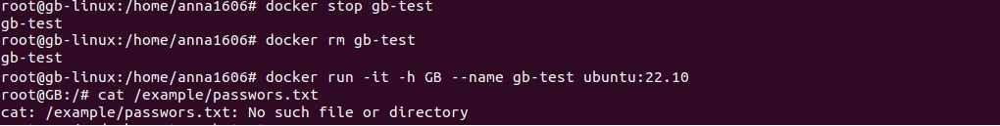
В этот раз наши данные будут утеряны, так как контейнер был удален.

## Использование внешнего хранилища.
* Создадим директорию и подмонтируем ее к контейнеру. Это позволит нам сохранить данные
```sh
    mkdir /test/folder
    docker run -it -h GB --name gb-test -v /test/folder:/otherway ubuntu:22.10
```
* Добавим данные в подмонтированную директорию и выйдем из контейнера:
```sh
    echo "$HOSTNAME" >> /otherway/test.txt
    exit
```
* Проверим доступность данных с локальной системы:
```sh
    cat /test/folder/test.txt
```
* Удалим контейнер и создадим его снова, подмонтировав директорию:
```sh
    docker rm gb-test
    docker run -it -h GB --name gb-test -v /test/folder:/otherway ubuntu:22.10
```
Мы видим, что данные по-прежнему доступны.

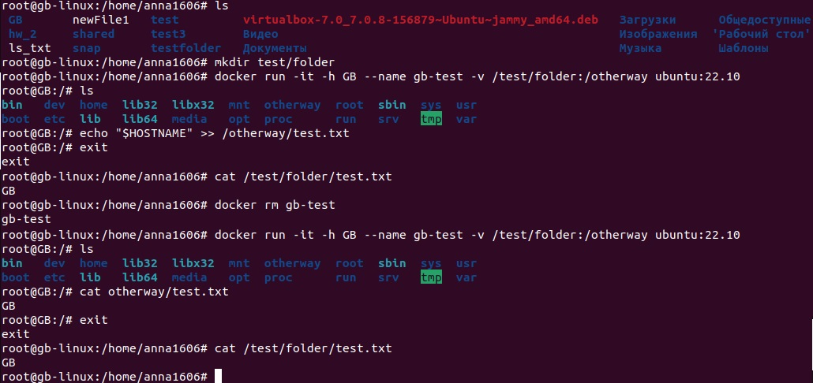

Заключение:
Самый надежный способ хранения данных в контейнерах - использование внешних хранилищ. Важно избегать хранения важных данных внутри контейнеров, чтобы предотвратить потерю информации.

## Практические примеры хранения данных в контейнерах Docker

* Создадим на хосте папку и в неё поместим файл `test.txt` c определённым содержимым.
```sh
    mkdir ~/docker-mount-example
    echo "This is the host test.txt file" > ~/docker-mount-example/test.txt
```
* В домашней директории создаем файл `test.txt`, который также понадобится для монтирования в контейнер, но с другим содержимым:
```sh
    echo "This is the root test.txt file" > ~/test.txt
```
* Создаем контейнер из образа ubuntu:22.10 и задаем ему имя и hostname:
```sh
    docker run -it -h GB --name gb-test ubuntu:22.10
```
* Монтируем ранее созданную папку с хоста в контейнер:
```sh
    docker run -it -h GB --name gb-test -v ~/docker-mount-example:/container-mount ubuntu:22.10
```
* Монтируем созданный ранее текстовый файл из домашней директории внутрь смонтированной папки в контейнере:
```sh
    docker run -it -h GB --name gb-test -v ~/docker-mount-example:/container-mount -v ~/test.txt:/container-mount/test.txt ubuntu:22.10
```
*  Проверяем содержимое текстового файла в контейнере и видим данные из файла в домашней директории:
```sh
    cat /container-mount/test.txt
```
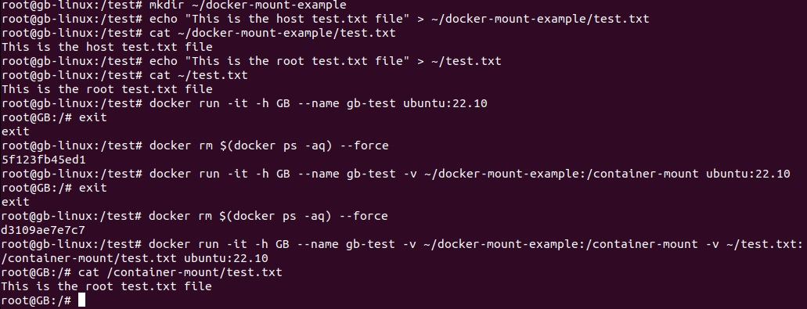

Мы создали контейнер и монтировали папку docker-mount-example внутрь контейнера. Затем мы монтировали файл test.txt из домашней директории внутрь этой папки в контейнере. При просмотре содержимого файла в контейнере, вы увидите данные из файла в домашней директории.