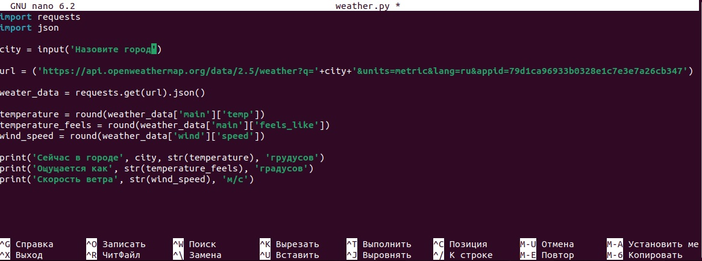
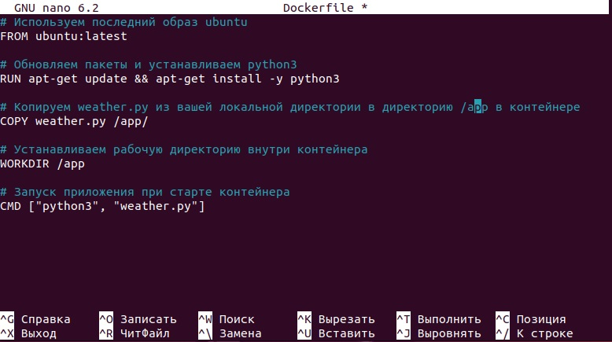
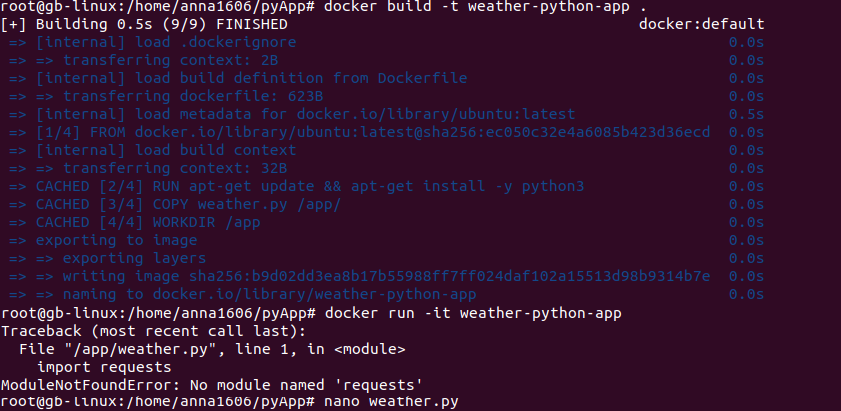
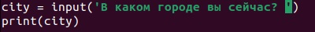
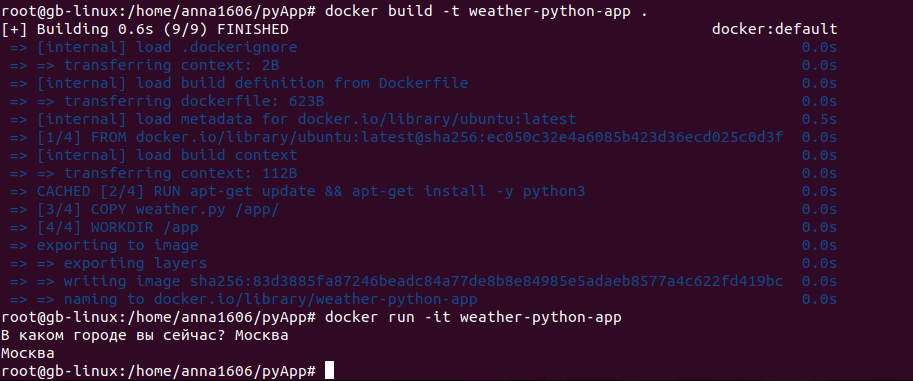

# Урок 4. Dockerfile и слои

## Задание: необходимо создать Dockerfile, основанный на любом образе (вы в праве выбрать самостоятельно). В него необходимо поместить приложение, написанное на любом известном вам языке программирования (Python, Java, C, С#, C++). При запуске контейнера должно запускаться самостоятельно написанное приложение.

* Переключаем управление командами на суперпользователя (root).
``` sh
    sudo su
```
* Создаем папку `pyApp` в своем пользовательском каталоге:
```sh
    mkdir pyApp
```
* Переходим внутрь созданной папки и создаем в ней файл с программой на языке `python`:
```sh
    cd pyApp
    nano weather.py
```


* Создаем Dockerfile для запуска контейнера с программой:
```sh
    nano Dockerfile
```


* Собираем наш проект:
```sh
    docker build -t weather-python-app .
```
* Запускаем наш проект в контейнере:
```sh
    docker run -it weather-python-app
```
и получаем вот такую ошибку:


В связи с чем пришлось писать очень простое приложение о городе местонахождения `( `



К сожалению, мне не удалось понять, как исправить ошибку с импортом библиотек python.