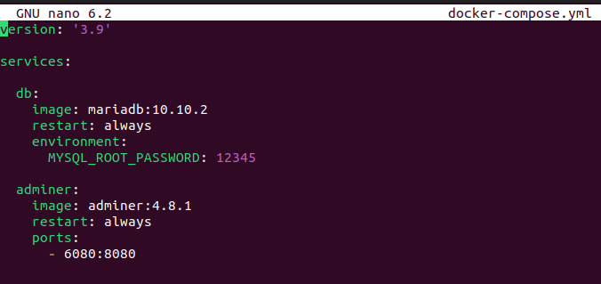

# Урок 5. Docker Compose и Docker Swarm
## Создать сервис, состоящий из 2 различных контейнеров: 1 - веб, 2 - БД (compose)

* Переключаем управление командами на суперпользователя (root).
``` sh
    sudo su
```
* Создаем папку для проекта и переходим в нее:
```sh
    mkdir compose
    cd compose
```
* Создаём в папке yaml-файл:
```sh
    nano docker-compose.yml
```

* Устанавливаем docker-compose:
```sh
    apt install docker-compose
```
* Создаем и запускаем наш проект в фоновом режиме из папки с .yml файлом:
```sh
    docker-compose up -d
```
* Перейдем в браузер и проверим всё ли получилось. Т.к.мы выполнили проброс портов, мы имеем доступ внутрь контейнера через
сетевой интерфейс хостовой машины. Вводим локальный адрес нашей машины в браузере:
```sh
    http://localhost:6080
```
и видим, что всё получилось

